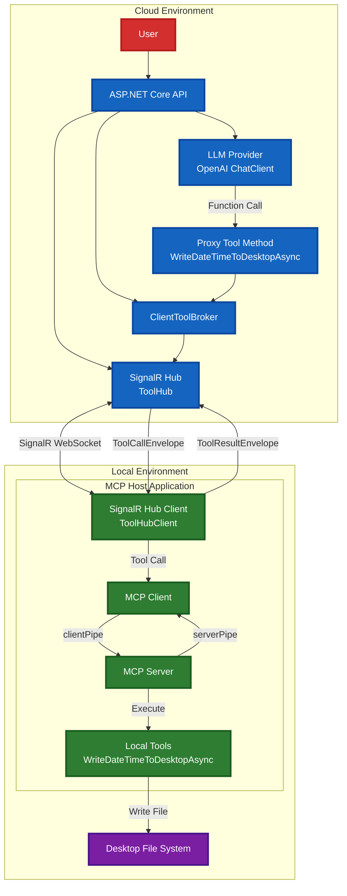

# MCP SignalR Bridge

A demonstration of connecting a locally running MCP (Model Context Protocol) Server to a hosted LLM API using SignalR for real-time communication.

## Overview

This project shows how to bridge the gap between local MCP servers and cloud-hosted LLM APIs, enabling LLMs to interact with local system resources while maintaining the benefits of hosted AI services.

## Try It Out
1. Clone the repository.
2. Update the API key in `API/Program.cs` with your OpenAI API key.
3. Build and run the API project:
   ```bash
   cd API
   dotnet run

   cd Client
   dotnet run

   # prompt something like:
   > Write a text file on my desktop named "datetime.txt" containing the current date and time.
   ```

## Technologies Used

- .NET 10
- ASP.NET Core
- SignalR
- Microsoft.Extensions.AI
- OpenAI

## Architecture




## Security Considerations

⚠️ **Warning**: This is a proof-of-concept. In production:
- Implement proper authentication and authorization
- Add LLM guardrails and tool call supervision
- Validate all inputs and sanitize file operations
- Consider using secure tunneling instead of direct SignalR connections

## Blog Post

Read the full technical breakdown: [Connecting a local MCP Server to a hosted LLM API](https://johnnys.news/2025/09/Connecting-a-local-MCP-Server-to-a-hosted-LLM-API/)

## License
MIT License. See `LICENSE` file for details.
